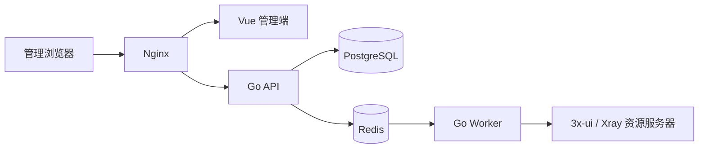

# XPanel v2

XPanel v2 是面向 3x-ui / Xray 多服务器环境的集中管理与编排面板。项目采用 Go API、Redis 任务队列和 Vue 管理端，目标是把资源接入、节点维护、客户端同步、健康检查与任务审计放进同一套可扩展架构中。

## 技术栈

| 组件 | 技术 |
| --- | --- |
| 后端 | Go 1.25.7、Gin、Ent |
| 前端 | Vue 3.5、Vite 7、TailwindCSS 3.4 |
| 数据库 | PostgreSQL 15+ |
| 缓存与任务 | Redis 7+、Asynq |
| 网关 | Nginx |

## 架构



## 当前版本

- 管理员登录和 Redis 会话
- CSRF、Argon2id 密码哈希与 AES-GCM 凭据加密
- 资源服务器新增、编辑、删除、全量检测和汇总
- 节点、客户端、SOCKS5 数量字段
- 调用节点 3x-ui Reality 扫描器并按延迟排序候选目标
- PostgreSQL 数据模型与 Ent 迁移
- Redis 异步资源检测与 Reality 扫描 Worker
- 任务流水与审计日志基础结构
- 首次安装随机生成管理员密码
- systemd、Nginx 和自动证书部署

## 支持系统

- Ubuntu 22.04 / 24.04
- Debian 12 / 13
- x86-64

建议至少 2 核 CPU、2 GB 内存和 10 GB 磁盘。安装器会在低内存机器上创建 1 GB 交换空间。

## 安装

```bash
git clone https://github.com/zhou1h/3xui-network-panel-v2.git
cd 3xui-network-panel-v2
DOMAIN=panel.example.com bash scripts/install.sh
```

安装完成后，首次登录信息保存在服务器的 `/root/xpanel-v2-credentials.txt`。

## 本地开发

```bash
cp .env.example .env
go generate ./ent
go run ./cmd/api
```

另开终端运行前端：

```bash
cd web
pnpm install
pnpm dev
```

## 常见问题

### API 显示 503

检查 PostgreSQL、Redis 和 API 服务：

```bash
systemctl status postgresql redis-server xpanel-api
journalctl -u xpanel-api -n 100 --no-pager
```

### 页面能打开但登录失败

确认浏览器访问的是 HTTPS 域名，并检查 Redis 与 API 日志。首次账号信息只在服务器 root 凭据文件中保存。

### 域名证书申请失败

先确认域名已指向服务器，并确保 80、443 端口可访问，然后执行：

```bash
certbot --nginx -d panel.example.com
```

## 卸载

```bash
bash scripts/uninstall.sh
```

卸载脚本默认保留 PostgreSQL 数据库和 `/etc/xpanel` 配置，避免误删管理数据。

## English

XPanel v2 is a centralized orchestration panel for multi-server 3x-ui and Xray deployments. It combines a Go/Gin/Ent API, PostgreSQL, Redis-backed workers, and a Vue administration interface.

### Quick start

```bash
git clone https://github.com/zhou1h/3xui-network-panel-v2.git
cd 3xui-network-panel-v2
DOMAIN=panel.example.com bash scripts/install.sh
```

The installer generates a random first-login password and stores it in `/root/xpanel-v2-credentials.txt` on the server.
